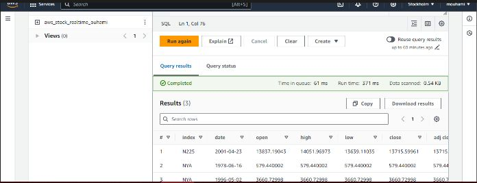

# Kafka AWS Stock Market

## Project Overview

The **Kafka AWS Stock Market** project is designed to demonstrate a real-time data pipeline using Apache Kafka and AWS services. In this project, we set up a Kafka producer that reads stock market data from a CSV file and sends it to a Kafka consumer. The consumer then processes the data and uploads it to an Amazon S3 bucket. Finally, we use AWS Glue to catalog the data and query it using Amazon Athena, allowing us to retrieve the data in a tabular format.

## Architecture

The architecture of the project is as follows:


1. **Kafka Producer**: Reads stock market data from a CSV file and sends each record to a Kafka topic.
2. **Kafka Consumer**: Consumes records from the Kafka topic and uploads them to an Amazon S3 bucket in JSON format.
3. **Amazon S3**: Serves as the data lake for storing raw and processed data.
4. **AWS Glue**: Crawlers are used to catalog the data stored in S3, enabling easy querying.
5. **Amazon Athena**: Allows for SQL querying of the data stored in S3 in a tabular format.

## Setup Instructions

### Prerequisites

- AWS Account
- Apache Kafka installed
- Java Development Kit (JDK)
- Python (for the consumer script)
- Required Python packages (boto3, pandas, etc.)

### Step 1: Set Up Kafka Producer

1. Create a Kafka topic named `stock-data`:
   ```bash
   kafka-topics.sh --create --topic stock-data --bootstrap-server localhost:9092 --partitions 1 --replication-factor 1
   ```

2. Implement the Kafka producer in Python:
   ```python
   from kafka import KafkaProducer
   import pandas as pd
   import json

   # Load data from CSV
   df = pd.read_csv('path/to/stock_data.csv')

   producer = KafkaProducer(bootstrap_servers='localhost:9092')

   for index, row in df.iterrows():
       # Convert each row to JSON and send to Kafka
       producer.send('stock-data', value=json.dumps(row.to_dict()).encode('utf-8'))

   producer.close()
   ```

### Step 2: Set Up Kafka Consumer

1. Implement the Kafka consumer in Python:
   ```python
   from kafka import KafkaConsumer
   import boto3
   import json

   consumer = KafkaConsumer('stock-data', bootstrap_servers='localhost:9092', auto_offset_reset='earliest')

   s3 = boto3.client('s3')
   bucket_name = 'your-s3-bucket-name'

   for message in consumer:
       # Parse the message and upload to S3
       record = json.loads(message.value.decode('utf-8'))
       s3.put_object(Bucket=bucket_name, Key=f"stocks/{record['symbol']}.json", Body=json.dumps(record))

   consumer.close()
   ```

### Step 3: AWS Glue Cataloging

1. **Create a Crawler** in AWS Glue:
   - Specify the S3 bucket where JSON files are stored.
   - Configure the crawler to recognize the schema of the data.

2. **Run the Crawler** to catalog the data in AWS Glue.

### Step 4: Querying with Amazon Athena

1. **Open Amazon Athena** and select the database created by the Glue crawler.
2. Use SQL queries to analyze the data:
   ```sql
   SELECT * FROM stock_data LIMIT 10;
   ```

## Screenshots

### 1. S3 Bucket Uploads


### 2. JSON Files in S3 Bucket


### 3. Tabular Data in Athena



## Conclusion

The **Kafka AWS Stock Market** project effectively demonstrates how to build a real-time data pipeline using Apache Kafka and AWS services. This setup allows for scalable data processing and analytics, providing valuable insights into stock market data.

## Acknowledgments

- Apache Kafka
- AWS Services (S3, Glue, Athena)
- Pandas for data manipulation
- Boto3 for AWS SDK in Python
